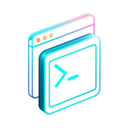
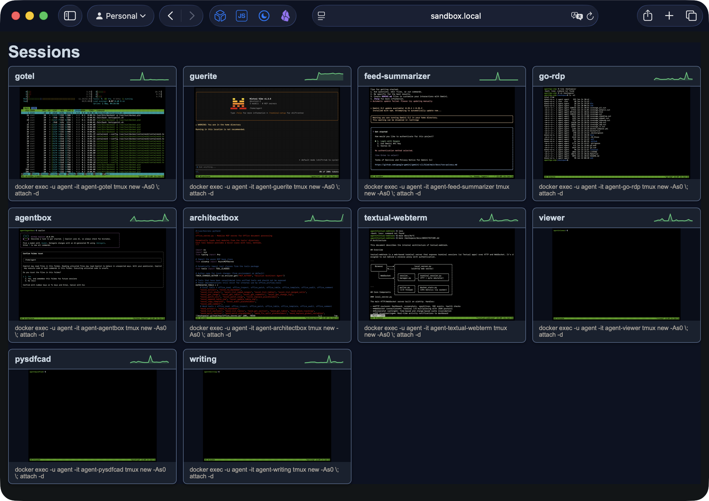

# textual-webterm



Serve terminal sessions and Textual apps over the web with a simple CLI command.

This is heavily based on [textual-web](https://github.com/Textualize/textual-web), but specifically focused on serving a persistent terminal session in a way that you can host behind a reverse proxy (and some form of authentication).

Built on a [patched version of ghostty-web](https://github.com/rcarmo/ghostty-web) (replacing the original xterm.js dependency), this package provides an easy way to expose terminal sessions via HTTP/WebSocket with automatic reconnection support.

> **Note:** This project originally used [textual-web](https://github.com/Textualize/textual-web) with xterm.js. It has been rewritten to use [ghostty-web](https://github.com/coder/ghostty-web)'s WebAssembly-based terminal emulator, which provides better performance and native theme support. Textual app serving has been deprecated in favor of direct terminal access.

Coupled with [`agentbox`](https://github.com/rcarmo/agentbox), you can use it to keep track of several containerized AI coding agents:



## Features

- 🖥️ **Web-based terminal** - Access your terminal from any browser
- 📱 **Mobile support** - Works on iOS Safari and Android with on-screen keyboard
- 🐍 **Textual app support** - Serve Textual apps directly from Python modules
- 🔄 **Session reconnection** - Refresh the page and reconnect to the same session
- 🎨 **Full terminal emulation** - Colors, cursor, and ANSI codes work correctly
- 🎭 **Customizable themes** - 9 built-in themes (monokai, dracula, nord, etc.)
- 🔤 **Custom fonts** - Configure terminal font family and size
- 📜 **Scrollback history** - Scroll back through terminal output (configurable)
- 📐 **Auto-sizing** - Terminal automatically resizes to fit the browser window
- 📸 **Live screenshots** - Dashboard shows real-time SVG screenshots of terminals
- 📊 **CPU sparklines** - Dashboard displays 30-minute CPU history for Docker containers
- ⚡ **SSE updates** - Real-time screenshot updates via Server-Sent Events
- 🚀 **Simple CLI** - One command to start serving

## Non-Features

- **No Authentication** - this is meant to be used inside a dedicated container, and you should set up an authenticating reverse proxy like `authelia`
- **No Encryption (TLS/HTTPS)** - again, this is meant to be fronted by something like `traefik` or `caddy`

## Installation

Install from PyPI:

```bash
pip install textual-webterm
```

Or install directly from GitHub:

```bash
pip install git+https://github.com/rcarmo/textual-webterm.git
```

## Quick Start

### Serve a Terminal

Serve your default shell:

```bash
textual-webterm
```

Serve a specific command:

```bash
textual-webterm htop
```

### Serve a Textual App

Serve a Textual app from an installed module:

```bash
textual-webterm --app mypackage.mymodule:MyApp
```

Serve a Textual app from a Python file:

```bash
textual-webterm --app ./calculator.py:CalculatorApp
```

### Options

Specify host and port:

```bash
textual-webterm --host 0.0.0.0 --port 8080 bash
```

Customize theme and font:

```bash
textual-webterm --theme dracula --font-size 18
textual-webterm --theme nord --font-family "JetBrains Mono, monospace"
```

Available themes: `monokai` (default), `dark`, `light`, `dracula`, `catppuccin`, `nord`, `gruvbox`, `solarized`, `tokyo`.

Then open http://localhost:8080 in your browser.

## Session Dashboard

You can serve a dashboard with multiple terminal tiles driven by a YAML manifest:

```yaml
- name: My Service
  slug: my-service
  command: docker logs -f my-service
```

Run with:

```bash
textual-webterm --landing-manifest landing.yaml
```

### Docker Compose Integration

Point to a docker-compose file; services with the label `webterm-command` become tiles:

```yaml
services:
  db:
    image: postgres
    labels:
      webterm-command: docker exec -it db psql
```

Start with:

```bash
textual-webterm --compose-manifest compose.yaml
```

In compose mode, the dashboard displays **CPU sparklines** showing 30 minutes of container CPU usage history (requires access to Docker socket at `/var/run/docker.sock`).

### Dashboard Features

- **Live screenshots** - Terminal thumbnails update in real-time via SSE when activity occurs
- **CPU sparklines** - Mini charts showing container CPU usage (compose mode only)
- **Tab reuse** - Clicking the same tile reopens the existing browser tab
- **Auto-focus** - Terminals automatically receive keyboard focus on load

## CLI Reference

```
Usage: textual-webterm [OPTIONS] [COMMAND]

  Serve a terminal or Textual app over HTTP/WebSocket.

  COMMAND: Shell command to run in terminal (default: $SHELL)

Options:
  -H, --host TEXT               Host to bind to [default: 0.0.0.0]
  -p, --port INTEGER            Port to bind to [default: 8080]
  -a, --app TEXT                Load a Textual app from module:ClassName
                                Examples: 'mymodule:MyApp' or './app.py:MyApp'
  -L, --landing-manifest PATH   YAML manifest describing landing page tiles
                                (slug/name/command).
  -C, --compose-manifest PATH   Docker compose YAML; services with label
                                "webterm-command" become landing tiles.
  -t, --theme TEXT              Terminal color theme [default: monokai]
                                Options: monokai, dark, light, dracula,
                                catppuccin, nord, gruvbox, solarized, tokyo
  -f, --font-family TEXT        Terminal font family (CSS font stack)
  -s, --font-size INTEGER       Terminal font size in pixels [default: 16]
  --version                     Show the version and exit.
  --help                        Show this message and exit.
```

## API Endpoints

| Endpoint | Description |
|----------|-------------|
| `/` | Dashboard (with manifest) or terminal view |
| `/ws/{route_key}` | WebSocket for terminal I/O |
| `/screenshot.svg?route_key=...` | SVG screenshot of terminal |
| `/cpu-sparkline.svg?container=...` | CPU sparkline SVG (compose mode) |
| `/events` | SSE stream for activity notifications |
| `/health` | Health check endpoint |

## Development

### Setup (Makefile-first)

```bash
git clone https://github.com/rcarmo/textual-webterm.git
cd textual-webterm

# Install with dev dependencies via Makefile
make install-dev
```

### Common tasks (use Makefile)

- Lint: `make lint`
- Format: `make format`
- Tests: `make test`
- Coverage (fail_under=78): `make coverage`
- Full check (lint + coverage): `make check`
- Bump patch version: `make bump-patch`

### Frontend Development

The terminal UI is built with a [patched version of ghostty-web](https://github.com/rcarmo/ghostty-web), which provides Ghostty's VT100 parser via WebAssembly with native theme/palette support. This replaces the original xterm.js dependency used in earlier versions.

Key improvements over xterm.js:
- Native theme colors passed directly to WASM (no runtime color remapping)
- Smaller bundle size (~0.67 MB vs ~1.16 MB)
- IME input support for CJK languages
- Better Unicode and complex script rendering

The pre-built bundle is committed to the repo, so users can `pip install` without needing Node.js.

To rebuild the frontend after modifying `terminal.ts`:

```bash
# Requires Bun (https://bun.sh)
bun install
bun run build
# Or simply:
make bundle
```

For development with auto-rebuild:

```bash
make bundle-watch
```

### Notes

- WebSocket protocol (browser ↔ server) is JSON: `["stdin", data]`, `["resize", {"width": w, "height": h}]`, `["ping", data]`.
- Frontend source is in `src/textual_webterm/static/js/terminal.ts`.
- Screenshots use [pyte](https://github.com/selectel/pyte) for ANSI interpretation and custom SVG rendering.
- CPU stats are read directly from Docker socket using asyncio (no additional dependencies).

## Requirements

- Python 3.9+
- Linux or macOS

## License

MIT License - see [LICENSE](LICENSE) for details.

## Related Projects

- [ghostty-web](https://github.com/rcarmo/ghostty-web) - Patched Ghostty terminal for the web (vendored fork with theme support)
- [ghostty-web upstream](https://github.com/coder/ghostty-web) - Original Ghostty terminal for the web
- [Textual](https://github.com/Textualize/textual) - TUI framework for Python (legacy support)
- [pyte](https://github.com/selectel/pyte) - PYTE terminal emulator (used for SVG screenshots)
